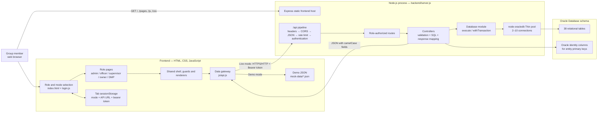
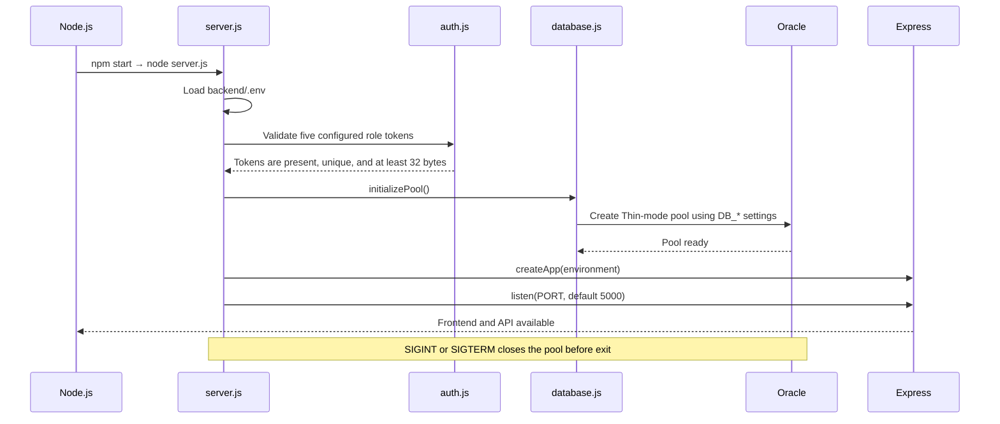
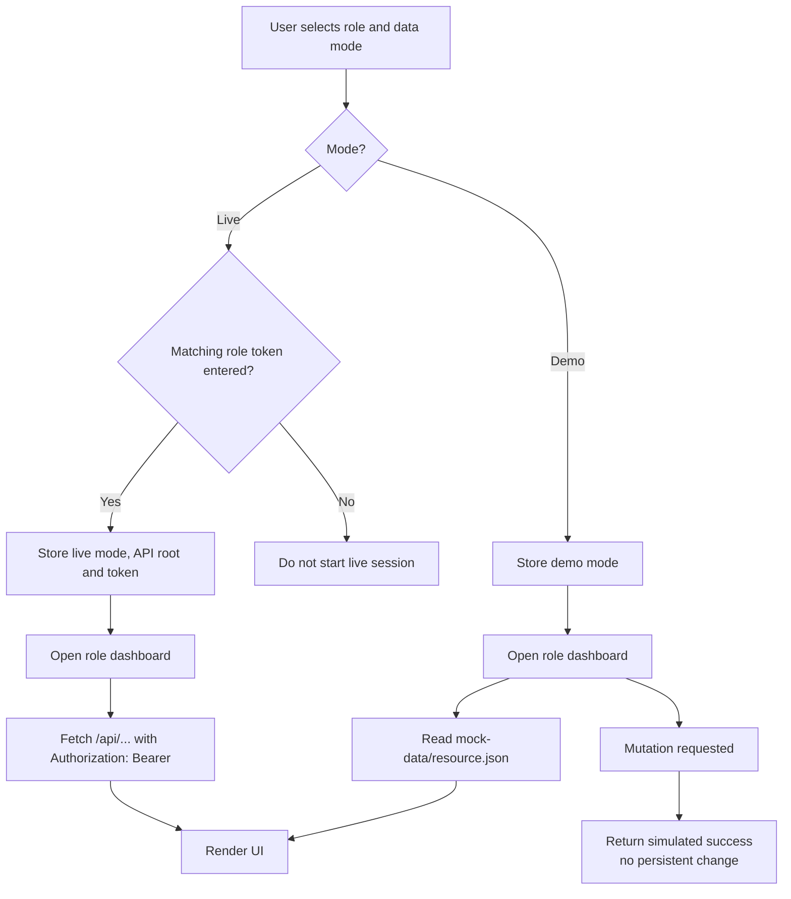
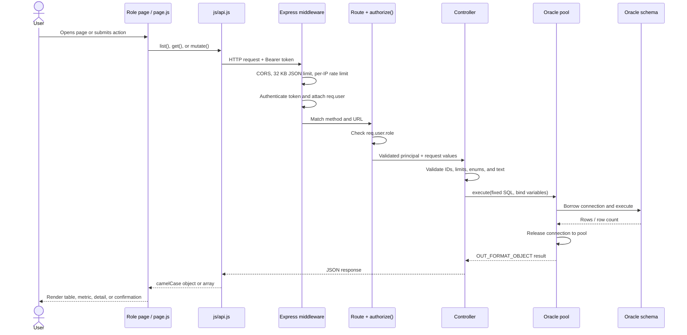
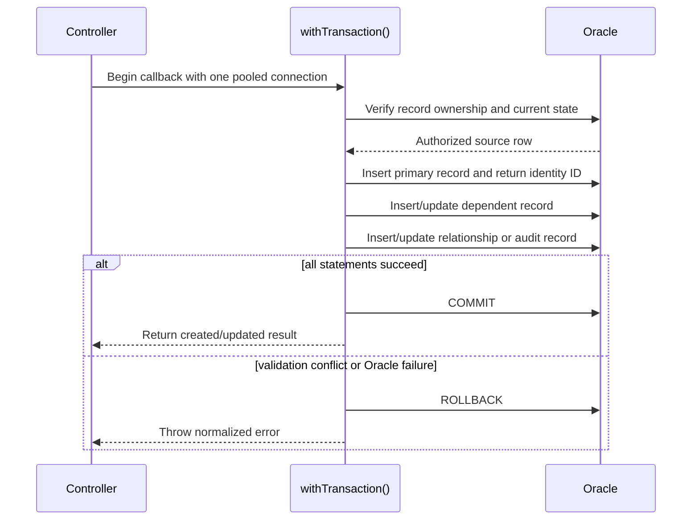
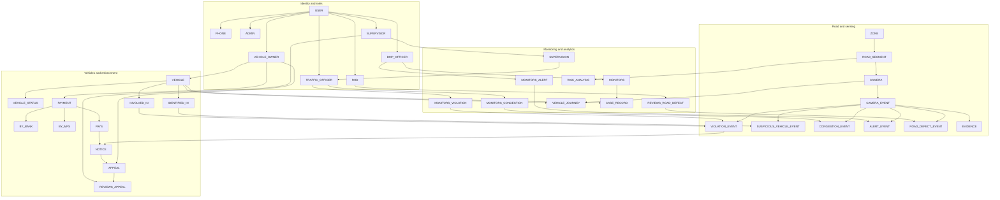
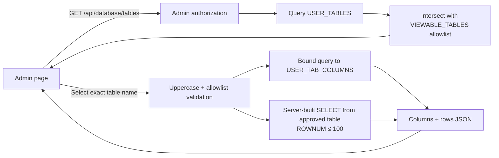

# Traffic AI Dhaka — System Architecture

This document describes the current repository as implemented. It covers the browser, Express application, authentication and authorization, Oracle access, SQL execution, schema, operating modes, and the boundary between implemented functionality and simulated demo behavior.

> The browser never connects directly to Oracle. Every live database operation goes through the authenticated Express API, which owns the Oracle credentials, validates the caller, runs server-controlled SQL, and returns JSON.

## 1. Current architecture at a glance



The current local live configuration is a **combined application**: one Express process serves both the frontend and `/api`. This removes the need for a separate Python web server during normal live use. The Python server remains useful for the standalone demo or an optional split frontend preview.

## 2. Technology stack

| Area | Current technology | Responsibility |
|---|---|---|
| Frontend | HTML5, CSS3, browser JavaScript ES modules | Role-specific screens, forms, tables, navigation, and client-side rendering |
| Frontend data layer | `js/api.js` using Fetch API | Selects demo/live source, adds bearer token, calls endpoints, normalizes errors |
| Backend | Node.js 20+ and Express 4 | Serves the frontend and exposes authenticated REST endpoints |
| Database driver | `node-oracledb` 6 in Thin mode | Creates the Oracle pool and executes SQL without Oracle Instant Client |
| Database | Oracle Database XE/Free, normally `FREEPDB1` | Stores normalized operational data, relationships, payments, appeals, and analytics |
| Configuration | `dotenv` and `backend/.env` | Supplies database connection settings, role tokens, seeded user mappings, CORS, and limits |
| Authentication | Shared role bearer tokens | Identifies one of five controlled group roles; suitable for the current demo boundary |
| Test/quality | Node test runner, custom static checker, npm audit, GitHub Actions | Verifies API contracts, access rules, source syntax, local references, and dependency state |

There is no frontend framework, ORM, trained AI model, external identity provider, payment gateway, object-storage service, or map service in the current repository.

## 3. Repository layers

| Path | Architectural role |
|---|---|
| `index.html`, `pages/` | Login/mode selection and role screens |
| `css/`, `assets/` | Shared visual system and static assets |
| `js/login.js` | Starts a role session and redirects to the selected dashboard |
| `js/api.js` | Only frontend module that selects and communicates with a data source |
| `js/page.js` | Page data loading, rendering, and supported mutations |
| `js/shell.js`, `js/router-guard.js` | Role navigation and frontend routing convenience; not the security boundary |
| `mock-data/` | Deterministic no-database demo records |
| `backend/server.js` | Process startup, token validation, pool initialization, listening, graceful shutdown |
| `backend/app.js` | Express middleware, routes, static hosting, 404 and error handling |
| `backend/routes/` | URL and HTTP-method definitions plus role authorization |
| `backend/controllers/` | Input validation, fixed SQL statements, transactions, and JSON results |
| `backend/config/database.js` | Oracle Thin connection pool and connection lifecycle helpers |
| `backend/middleware/` | Bearer authentication, role authorization, and rate limiting |
| `database/` | DDL, seed data, manual advanced reports, and teardown scripts |
| `backend/tests/`, `backend/scripts/` | Contract/API tests and repository static checks |
| `.github/workflows/ci.yml` | Automated verification on pushes to `main` and pull requests |

## 4. Startup and shutdown lifecycle



The server intentionally fails during startup if authentication tokens are missing, duplicated, or too short, or if Oracle cannot be reached. That prevents the frontend from appearing live while its data service is unusable.

## 5. Frontend modes and API address selection

The login page records three values in the current browser tab:

| `sessionStorage` key | Meaning |
|---|---|
| `trafficAiDataMode` | `demo` or `live` |
| `trafficAiApiBaseUrl` | Resolved API root |
| `trafficAiApiToken` | Token entered for the selected live role |

Logout removes these values. Other tabs do not inherit them.



`js/api.js` selects the live API root as follows:

- When the page is served from port `5000`, or from a non-local deployed origin, it uses the same origin: `window.location.origin + /api`.
- When a local static preview is served from a different port such as `4173`, it uses `http://localhost:5000/api`.

This same-origin behavior is one of the current integration updates: a normal live run needs only `npm start` and `http://localhost:5000/`.

## 6. Live request and query lifecycle



### Where the SQL comes from

Runtime queries are not sent by the browser. They are fixed, reviewed SQL strings in backend controllers:

- `vehicleController.js` — health, vehicles, and vehicle status;
- `noticeController.js` — notice list/detail and computed payment/appeal/overdue status;
- `appealController.js` — appeal reads, creation, and supervisor review;
- `paymentController.js` — owner payment-request creation;
- `resourceController.js` — an allowlisted registry of read-only domain queries;
- `databaseController.js` — admin-only metadata and allowlisted table browsing.

Dynamic values are passed as Oracle bind variables such as `:ownerId`, `:noticeId`, and `:limit`. The only dynamic table identifier is the database viewer table name, and it is accepted only after conversion to uppercase and exact membership in a fixed server allowlist.

### Example: an owner loads vehicles

1. `page.js` asks `api.js` for `vehicles`.
2. `api.js` calls `GET /api/vehicles?limit=100` with the owner bearer token.
3. Authentication maps that token to `{ role: "owner", ownerId: 17 }` using server configuration.
4. The vehicle controller adds `WHERE v.Vehicle_owner_id = :ownerId` and binds the server-side value `17`.
5. Oracle returns only that seeded owner's vehicles.
6. Quoted SQL aliases produce fields such as `licencePlateNo`, which are returned as JSON and rendered by the page.

The caller cannot request a different owner ID. Owner scoping comes from the authenticated server principal, not a browser query parameter.

## 7. API and authorization map

Every endpoint below requires authentication, including health.

| Method and path | Allowed roles | Purpose |
|---|---|---|
| `GET /api/health` | Any configured role | Run `SELECT 1 FROM DUAL` to verify API-to-Oracle access |
| `GET /api/vehicles` | Admin, officer, supervisor, owner, DMP | List vehicles; owners receive only their records |
| `GET /api/vehicle-status` | Admin, owner, DMP | List status history; owners are server-scoped |
| `GET /api/notices` | Admin, officer, supervisor, owner | List notices with computed state; owners are scoped |
| `GET /api/notices/:noticeId` | Admin, officer, supervisor, owner | Fetch one authorized notice |
| `GET /api/appeals` | Admin, officer, supervisor, owner | List appeals; owners are scoped |
| `POST /api/appeals` | Owner | Create one pending appeal for an owned notice |
| `PATCH /api/appeals/:appealId/review` | Supervisor | Decide an appeal and record reviewer audit data |
| `POST /api/payments` | Owner | Record a pending bank/MFS payment request for an owned notice |
| `GET /api/cameras` | Admin, officer, DMP | Camera inventory |
| `GET /api/zones` | Admin, officer, DMP | Zone inventory |
| `GET /api/roadSegments` | Admin, officer, DMP | Road segments |
| `GET /api/users` | Admin | User account view |
| `GET /api/cameraEvents` | Officer, supervisor, DMP | Camera event stream |
| `GET /api/violationEvents` | Officer, supervisor | Violation events |
| `GET /api/evidence` | Officer, supervisor | Evidence metadata |
| `GET /api/alertEvents` | Officer, DMP | Alert events |
| `GET /api/roadDefectEvents` | Officer | Road defect events |
| `GET /api/suspiciousVehicleEvents` | DMP | Suspicious vehicle detections |
| `GET /api/riskAnalysis` | Admin, DMP | Road-segment risk analysis |
| `GET /api/vehicleJourney` | DMP | Camera-observed vehicle journeys |
| `GET /api/database/tables` | Admin | List safe, viewable Oracle tables |
| `GET /api/database/tables/:tableName` | Admin | Read up to 100 rows plus column metadata from one allowlisted table |

List endpoints accept a positive integer `limit`; the backend defaults to and caps it at 100.

## 8. Authentication, authorization, and trust boundaries

The current demo uses five long, unique environment tokens:

```text
ADMIN_API_TOKEN        → role admin       → ADMIN_USER_ID
OFFICER_API_TOKEN      → role officer     → TRAFFIC_OFFICER_USER_ID
SUPERVISOR_API_TOKEN   → role supervisor  → SUPERVISOR_USER_ID
OWNER_API_TOKEN        → role owner       → OWNER_USER_ID
DMP_API_TOKEN          → role dmp         → DMP_OFFICER_USER_ID
```

Authentication performs timing-safe token comparison and attaches the matching principal to `req.user`. Route-level `authorize(...)` middleware is the actual access-control boundary. The role in the page URL and the frontend router guard affect presentation only and grant no backend permission.

Other current controls are:

- fixed SQL plus bind variables;
- server-side owner scoping;
- per-IP in-memory rate limiting, default 120 API requests per minute;
- JSON request bodies capped at 32 KB;
- configurable CORS allowlist for split-origin local development;
- restrictive headers on `/api` responses;
- generic client-facing database errors while server logs retain diagnostic details;
- an admin database-viewer allowlist that excludes identity phone data and payment tables.

For this controlled group demo, tokens are deliberately retained. They should never be committed, pasted into screenshots, or embedded in frontend source.

## 9. Oracle connection architecture

`backend/.env` supplies the connection fields:

```text
DB_USER, DB_PASSWORD, DB_HOST, DB_PORT, DB_SERVICE
```

The default service is `FREEPDB1` at `localhost:1521`. `database.js` constructs:

```text
DB_HOST:DB_PORT/DB_SERVICE
```

The driver operates in Thin mode, so Node talks to Oracle over its network protocol without Oracle Instant Client. The pool starts with two connections, can grow to ten, adds one at a time, and times out idle pooled connections after 60 seconds.

Two access helpers enforce connection cleanup:

- `execute(sql, binds, options)` borrows a connection, executes one statement, returns the result, and releases the connection in `finally`.
- `withTransaction(callback)` borrows one connection for several dependent statements, commits only after all succeed, rolls back on error, and then releases it.

### Transactional mutation flow



Appeal creation, appeal review, and payment-request creation use this pattern. A payment request writes `PAYMENT`, `PAYS`, and either `BY_BANK` or `BY_MFS` atomically, but it does not contact an external financial provider.

## 10. Database domain architecture

The schema contains 38 tables whose entity keys use Oracle identity columns where appropriate. The following view groups them by responsibility while preserving the principal relationships.



### Complete table inventory

- Identity: `USER`, `PHONE`, `ADMIN`, `SUPERVISOR`, `DMP_OFFICER`, `TRAFFIC_OFFICER`, `VEHICLE_OWNER`, `RHD`.
- Road and sensing: `ZONE`, `ROAD_SEGMENT`, `CAMERA`, `CAMERA_EVENT`, `VIOLATION_EVENT`, `SUSPICIOUS_VEHICLE_EVENT`, `CONGESTION_EVENT`, `ALERT_EVENT`, `ROAD_DEFECT_EVENT`, `EVIDENCE`.
- Vehicle and enforcement: `VEHICLE`, `VEHICLE_STATUS`, `NOTICE`, `PAYMENT`, `BY_BANK`, `BY_MFS`, `APPEAL`.
- Relationship and operations: `INVOLVED_IN`, `IDENTIFIED_IN`, `PAYS`, `REVIEWS_APPEAL`, `MONITORS_VIOLATION`, `MONITORS_CONGESTION`, `MONITORS_ALERT`, `REVIEWS_ROAD_DEFECT`, `SUPERVISION`, `CASE_RECORD`, `MONITORS`.
- Analytics: `RISK_ANALYSIS`, `VEHICLE_JOURNEY`.

Independent numeric entity keys are generated by Oracle identity columns; subtype, foreign-key, relationship, and weak-entity keys reuse their parent identifiers.

## 11. SQL file lifecycle and the five advanced queries

| File | When it runs | Purpose |
|---|---|---|
| `database/01_create_tables.sql` | Once during initial provisioning, or after a reset | Creates 38 tables, constraints, identity columns, and indexes |
| `database/02_insert_demo_data.sql` | After schema creation | Inserts deterministic coursework/demo records used by the live UI |
| `database/03_advanced_queries.sql` | Manually, whenever reports are required | Contains five standalone advanced SQL reports |
| `database/04_drop_tables.sql` | Manually before a complete reset | Removes project objects in dependency-safe order |

The DDL and seed scripts prepare Oracle; the backend does not import or rerun them when Node starts. Similarly, `03_advanced_queries.sql` is present and valid for manual execution, but its five statements are **not currently exposed as API endpoints or automatically called by the frontend**.

The five advanced reports are:

1. **Vehicle-owner violation and fine report** — joins vehicle, owner, violation, camera event, involvement, and notice data; sorts fines from highest to lowest.
2. **DMP case monitoring report** — joins case records, DMP monitoring, officer subtype, and user identity data; orders the monitoring timeline.
3. **Road-segment congestion summary** — groups congestion events by road segment and calculates event count, average vehicle count, and maximum vehicle count.
4. **Road-segment violation ranking** — uses a common table expression, outer joins, aggregation, and `DENSE_RANK()` so even segments with zero violations can be ranked.
5. **Payment method and status totals** — combines bank and MFS payments with `UNION ALL`, then groups count and amount by method and status.

To execute them today, connect as the project schema user in SQL Developer or SQL*Plus and run the file. To show them in the web application later, each report should receive a fixed backend controller query, an authorized route, a stable response contract, and a frontend page call. The browser should not be allowed to submit arbitrary SQL.

## 12. Admin database viewer flow

The database viewer is a constrained inspection feature, not a general SQL console.



The allowlist contains 23 operational tables. It intentionally excludes `USER`, `PHONE`, `PAYMENT`, `BY_BANK`, `BY_MFS`, and `PAYS`, among others that are not needed in the viewer.

## 13. Data contracts

Oracle object results use SQL aliases to produce stable camelCase JavaScript keys. For example, database names such as `Licence_plate_no` and `Event_date` are returned to the browser as `licencePlateNo` and `eventDate` where the resource contract specifies them.

This separation is important:

```text
Oracle schema naming → controller SELECT aliases → JSON contract → page renderer
```

Frontend code therefore does not depend on driver-generated uppercase column names. Contract tests lock down exact resource keys so a SQL alias change cannot silently break a page.

## 14. Error and response behavior

| Condition | Typical response |
|---|---|
| Missing or invalid bearer token | `401` |
| Valid token with disallowed role | `403` |
| Invalid ID, limit, enum, or request body | `400` |
| Owned/authorized record not found | `404` |
| Duplicate appeal or already-paid notice conflict | `409` |
| Per-IP request allowance exceeded | `429` |
| Oracle or unexpected server failure | Generic `500`, with details logged only on the server |

The frontend data gateway converts non-success responses into consistent errors for the page layer.

## 15. Current implementation updates

The architecture now includes these repository updates:

- Express serves the frontend and API from one process for normal live use.
- The frontend automatically uses a same-origin API when served by Express or hosted under one origin.
- Local split-origin development remains supported through `CORS_ORIGINS` and port-aware API selection.
- The login screen's decorative three-color element was removed, and the left-side message was enlarged and centered vertically within its left panel.
- Owner appeals, supervisor appeal reviews, and owner payment requests are live Oracle transactions.
- Server-side role authorization and owner scoping protect live data.
- The admin database viewer is allowlisted and excludes sensitive/payment tables.
- Oracle SQL scripts are SQL*Plus-compatible, including the schema script's blank-line handling.
- Automated checks and GitHub Actions cover source integrity, API contracts, access restrictions, schema teardown coverage, and page references.

## 16. Local operating layouts

### Recommended live layout

```text
Browser http://localhost:5000
        │
        └── Express process (static frontend + /api)
                    │
                    └── Oracle listener localhost:1521/FREEPDB1
```

Start with:

```powershell
cd backend
npm start
```

### Standalone demo layout

```text
Browser http://127.0.0.1:4173
        │
        └── Python static server → frontend + mock-data JSON

No Node API and no Oracle connection are required.
```

### Optional split local live layout

```text
Browser/Python :4173 → Fetch/CORS → Express API :5000 → Oracle :1521
```

Both `http://127.0.0.1:4173` and `http://localhost:4173` are allowed by the default development CORS configuration.

## 17. Verification architecture

On every push to `main` and every pull request, GitHub Actions uses Node 22 to run:

```text
npm ci → npm run check → npm test
```

The local verification sequence also includes `npm audit --omit=dev`. Tests exercise authentication, role denial, static frontend serving, safe database-viewer coverage, contract keys, and parsing behavior. The custom checker validates JavaScript and JSON, local HTML references, Oracle teardown coverage, licence-plate capacity, and the absence of the removed plaintext demo-password pattern.

## 18. Implemented versus simulated boundaries

Implemented end-to-end:

- role-token authentication and authorization;
- frontend/API integration;
- Oracle pooled reads for the documented resources;
- owner-scoped data access;
- transactional appeal submission and review;
- transactional pending payment-request storage;
- admin-safe database browsing;
- mock/live mode switching and automated verification.

Still modeled or simulated:

- AI detection/inference—the database contains seeded AI-like results, but no model runs;
- real bank/MFS payment processing;
- video/image evidence upload and storage;
- live camera ingestion, GPS, maps, notifications, or external agency integration;
- database-backed user passwords and individual login sessions;
- most administrative create/update/delete workflows;
- automatic execution or frontend presentation of the five advanced reports.

## 19. End-to-end operational summary

1. Oracle is provisioned once with `01_create_tables.sql` and `02_insert_demo_data.sql`.
2. Node loads secrets/configuration, validates tokens, and opens an Oracle connection pool.
3. Express exposes the frontend and protected API on port `5000`.
4. A group member chooses a role and demo/live mode on the login page.
5. In demo mode, the browser reads local JSON; in live mode, it sends its role token to the API.
6. Express authenticates the token, authorizes the route, and supplies the trusted role/user mapping.
7. A controller validates inputs and runs fixed, bound SQL through a pooled Oracle connection.
8. Oracle results are returned as stable camelCase JSON and rendered in the selected role page.
9. Multi-statement mutations commit as a unit or roll back as a unit.
10. Manual analytical work can run `03_advanced_queries.sql` directly against the same schema; it is separate from the current runtime API.

For machine setup, service checks, schema loading, and restart commands, see [NEW_LAPTOP_SETUP.md](NEW_LAPTOP_SETUP.md). For a compact page/route/data inventory, see [PROJECT_MAP.md](PROJECT_MAP.md).
