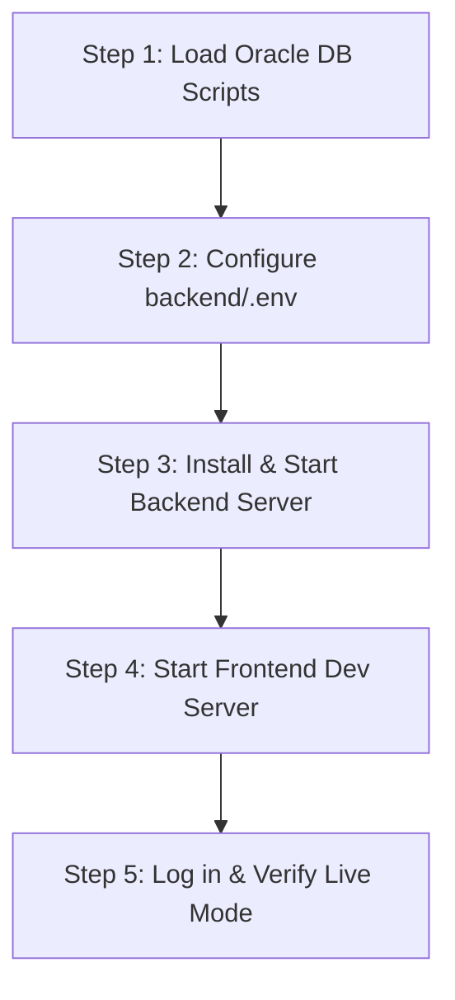

# AI Traffic Management System — Frontend & Backend Connection Guide & Cursor Directive

This file is designed for **Cursor AI (and other AI agents)** and the **Developer** to seamlessly connect, run, and verify the frontend, backend, and Oracle Database integration.

---

## 🤖 [FOR CURSOR / AI AGENTS] Autonomous Execution Prompt

> **Instructions for Cursor Agent / Composer:**
> When the user asks you to connect, fix, or enhance the frontend-backend connection in this repository, follow these specifications:
>
> 1. **Architecture Overview**:
>    - **Database**: Oracle DB (PDB `FREEPDB1`, schema `SMART_TRAFFIC`). Schema definitions are in `database/01_create_tables.sql` and demo data in `database/02_insert_demo_data.sql`.
>    - **Backend**: Node.js + Express (located in `backend/`) running on `http://localhost:5000/api`. Uses `oracledb` connection pool (`backend/config/database.js`).
>    - **Frontend**: Vanilla ES6+ Modules (`js/api.js`, `js/page.js`, `js/shell.js`) with static HTML (`pages/`, `index.html`) served on `http://127.0.0.1:4173` via `dev-server.js`.
>
> 2. **API Communication Standard**:
>    - **Base URL**: Configured dynamically in `js/api.js` (`DEFAULT_API_BASE_URL = http://localhost:5000/api`).
>    - **Auth & Tokens**: Use Bearer token from `sessionStorage.trafficAiApiToken`. Role-based demo tokens are configured in `backend/middleware/auth.js` (e.g., `admin-live-token`, `traffic-officer-live-token`, `dmp-officer-live-token`, `vehicle-owner-live-token`).
>    - **Data Mode**: Support both `live` (Oracle API calls via `fetch`) and `mock` fallback. Toggle is handled in `js/api.js`.
>
> 3. **When Connecting a Frontend Feature to Backend**:
>    - Check the corresponding route in `backend/routes/` and controller in `backend/controllers/`.
>    - Ensure SQL queries in the controller match table definitions in `database/01_create_tables.sql`.
>    - Call endpoints via `list()`, `get()`, or `mutate()` from `js/api.js` inside UI render functions in `js/page.js`.
>    - Always handle loading states, error alerts (`ApiError`), and empty result sets gracefully in the UI.

---

## 📋 Step-by-Step Action Plan to Make It 100% Successful

Follow these 5 steps to get the full system running locally with live Oracle DB data:



---

### Step 1: Initialize the Oracle Database
Open **Oracle SQL Developer**, **SQL*Plus**, or **DBeaver** connected to your pluggable database (`FREEPDB1` / `XEPDB1` as user `SMART_TRAFFIC` or `SYSTEM`):

1. **Run Table Creation Script**:
   - File: [`database/01_create_tables.sql`](file:///e:/ai_traffic/database/01_create_tables.sql)
   - Creates all core entities (`USER`, `VEHICLE`, `NOTICE`, `APPEAL`, `PAYMENT`, `CASE_RECORD`, etc.).

2. **Run Demo Data Script**:
   - File: [`database/02_insert_demo_data.sql`](file:///e:/ai_traffic/database/02_insert_demo_data.sql)
   - Populates users, vehicles, notices, appeals, payments, and road network data.

3. *(Optional)* Run PL/SQL procedures and packages if available in `database/` (`03_packages_procedures.sql` etc.).

---

### Step 2: Configure Backend Environment Variables
Inspect or edit [`backend/.env`](file:///e:/ai_traffic/backend/.env):

```env
PORT=5000
NODE_ENV=development

# Oracle Database Connection Details
DB_USER=SMART_TRAFFIC
DB_PASSWORD=your_oracle_password_here
DB_HOST=localhost
DB_PORT=1521
DB_SERVICE=FREEPDB1

# Authentication Demo Tokens (pre-configured)
AUTH_TOKEN_ADMIN=admin-live-token
AUTH_TOKEN_TRAFFIC_OFFICER=traffic-officer-live-token
AUTH_TOKEN_DMP_OFFICER=dmp-officer-live-token
AUTH_TOKEN_VEHICLE_OWNER=vehicle-owner-live-token
```

> **Note**: If using Oracle 23ai Free, `DB_SERVICE=FREEPDB1`. If using Oracle 21c/19c Express Edition, use `DB_SERVICE=XEPDB1`.

---

### Step 3: Install Dependencies & Start Backend
Open a terminal in the project root:

```powershell
# 1. Navigate to backend directory
cd backend

# 2. Install dependencies (if not already installed)
npm install

# 3. Start the Express API server
npm run dev
# or: node server.js
```

You should see:
```text
✓ Oracle connection pool created successfully (Thin mode) -> localhost:1521/FREEPDB1
Backend server listening on http://localhost:5000
```

---

### Step 4: Start Frontend Server
Open a **second terminal** in the root directory:

```powershell
# In root directory: e:\ai_traffic
node dev-server.js
```

You should see:
```text
Server running at http://127.0.0.1:4173/
```

---

### Step 5: Test Connection in Browser
1. Open browser at: `http://127.0.0.1:4173`
2. Select any Role on the Login screen (Admin, Traffic Officer, DMP Officer, or Vehicle Owner).
3. Select **"Live Oracle Database"** mode.
4. Click **Log In**.
5. The system will automatically:
   - Validate token via `GET http://localhost:5000/api/health`
   - Fetch live data from Oracle DB for vehicles, notices, appeals, payments, and reports.

---

## 🛠️ Key API Endpoints Reference

| Category | Endpoint | Method | Description |
| :--- | :--- | :--- | :--- |
| **System** | `/api/health` | `GET` | Health check & authentication token role validator |
| **Vehicles** | `/api/vehicles` | `GET`, `POST` | List and register vehicles |
| **Notices** | `/api/notices` | `GET`, `POST` | Violation challans / notices issued |
| **Appeals** | `/api/appeals` | `GET`, `POST`, `PATCH` | Submit & review appeal decisions |
| **Payments** | `/api/payments` | `GET`, `POST` | Process fine payments (Bank / MFS) |
| **DB Viewer** | `/api/database/tables` | `GET` | Live Oracle DB table records inspector |
| **Reports** | `/api/reports/vehicle-violations` | `GET` | Aggregated violation summary reports |
| **Reports** | `/api/reports/pending-appeals` | `GET` | Pending appeals queue |

---

## 💡 Troubleshooting & Common Issues

- **ORA-12514 / ORA-12541 (TNS Listener / Service not found)**:
  - Verify Oracle service name in `.env` (`lsnrctl status` in CMD).
- **ORA-01017 (Invalid username/password)**:
  - Check `DB_USER` and `DB_PASSWORD` in `backend/.env`.
- **CORS Error in Browser**:
  - `backend/app.js` has `cors()` middleware enabled. Ensure backend is running on `PORT=5000`.
